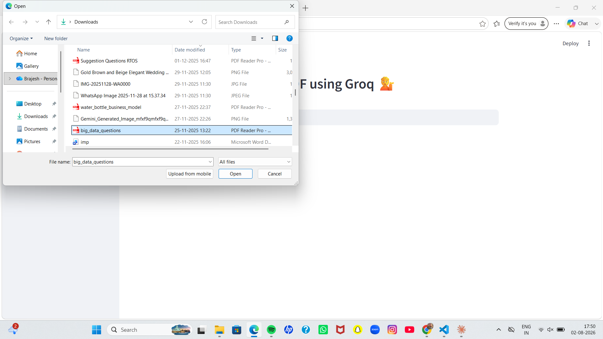
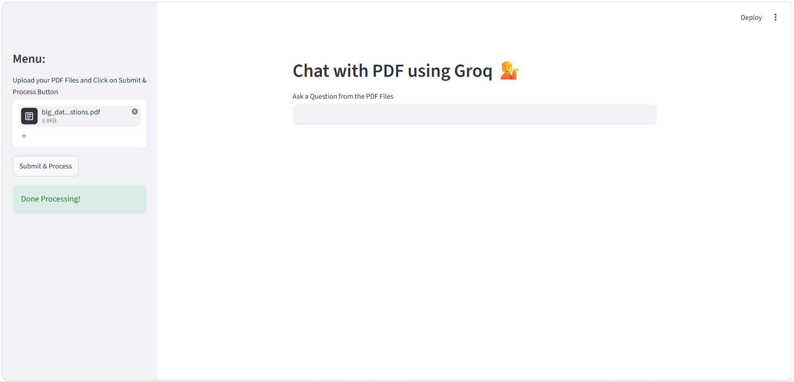
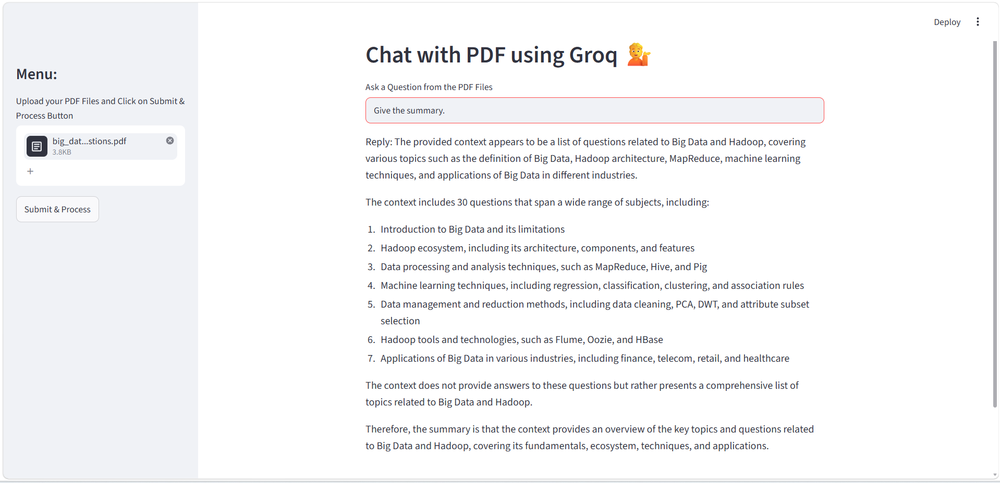

# 🤖 DocuQuery AI — An Intelligent Retrieval Augmented Generation System

> Upload documents. Ask questions. Get intelligent answers — instantly.


---

## Overview

**DocuQuery AI** is an intelligent document question-answering system built using **Retrieval Augmented Generation (RAG)**. It allows users to upload PDF documents and interactively ask questions about their content. Instead of reading through lengthy documents, simply ask — and get precise, context-aware answers powered by LLMs.

---

## Features

- 📄 **PDF Document Ingestion** — Upload any PDF and extract its content automatically
- 🔍 **Semantic Search** — Uses FAISS vector store for fast and accurate similarity search
- 🔗 **RAG Pipeline** — Combines retrieval with LLM generation for grounded, accurate answers
- ⚡ **Groq-Powered LLM** — Ultra-fast inference using Groq's API
- 🧩 **LangChain Integration** — Modular and extensible chain-based architecture
- 🖥️ **Streamlit UI** — Clean, interactive web interface — no frontend knowledge needed
- 🔐 **Secure** — API keys managed via `.env`, never hardcoded

---

## 📸 Screenshots

### Home Screen
Clean landing interface with a PDF upload option in the sidebar.


### Uploading a PDF
Selecting and uploading a PDF file for processing.



### Processing Complete
Text extraction, chunking, and embedding generation completed successfully — the vector index is ready for querying.



### Asking a Question & Getting an Answer
The chatbot retrieves the most relevant context and generates a grounded answer using Groq's LLM.



---

## How It Works

```
📄 PDF Upload
     │
     ▼
Text Extraction (PyPDF / LangChain Document Loaders)
     │
     ▼
✂️  Text Chunking (RecursiveCharacterTextSplitter)
     │
     ▼
🧬 Embedding Generation (HuggingFace Embeddings)
     │
     ▼
🗄️  Vector Storage (FAISS Index)
     │
     ▼
❓ User Query
     │
     ▼
🔍 Semantic Retrieval (Top-K similar chunks)
     │
     ▼
🤖 LLM Answer Generation (Groq API via LangChain)
     │
     ▼
💬 Final Answer displayed in Streamlit UI
```

1. **Document Loading** — The PDF is loaded and parsed into raw text
2. **Chunking** — Text is split into overlapping chunks for better context retention
3. **Embedding** — Each chunk is converted into a vector embedding
4. **Indexing** — Embeddings are stored in a FAISS vector index for fast retrieval
5. **Querying** — On user query, the most relevant chunks are retrieved
6. **Generation** — Retrieved chunks + user query are passed to the Groq LLM for a final answer

---

## 🛠️ Tech Stack

| Technology | Purpose |
|-----------|---------|
| **Python** | Core programming language |
| **LangChain** | RAG pipeline & chain orchestration |
| **FAISS** | Vector similarity search & storage |
| **Groq API** | Fast LLM inference |
| **Streamlit** | Interactive web UI |
| **PyPDF** | PDF text extraction |
| **HuggingFace Embeddings** | Text-to-vector conversion |

---

## 🚀 Installation & Setup

### 1. Clone the repository
```bash
git clone https://github.com/harshpathak-19/DocuQuery-AI-An-Intelligent-Retrieval-Augmented-Generation-System.git
cd DocuQuery-AI-An-Intelligent-Retrieval-Augmented-Generation-System
```

### 2. Create a virtual environment
```bash
python -m venv venv

# On Windows
venv\Scripts\activate

# On Mac/Linux
source venv/bin/activate
```

### 3. Install dependencies
```bash
pip install -r requirement.txt
```

### 4. Set up environment variables
Create a `.env` file in the root directory:
```env
GROQ_API_KEY=api_key_here
```

Get a free API key from [console.groq.com](https://console.groq.com).

### 5. Run the application
```bash
streamlit run app.py
```

### 6. Open in browser
```
http://localhost:8501
```

---

## 📁 Project Structure

```
DocuQuery-AI/
│
├── screenshots/            # README screenshots
├── data/                    # Sample PDF files
├── app.py                   # Main Streamlit application
├── requirement.txt          # Python dependencies
├── .env                      # API keys (not pushed to GitHub)
├── .gitignore                # Ignores .env, faiss_index, venv/
└── README.md                 # Project documentation
```

---

## 🔮 Future Improvements

- [ ] 🗂️ Support for multiple document formats (DOCX, TXT, CSV)
- [ ] 💬 Chat history & multi-turn conversation memory
- [ ] 🌐 Deploy on Streamlit Cloud / Hugging Face Spaces
- [ ] 📊 Document summarization feature
- [ ] 🔐 User authentication & session management
- [ ] 🧩 Support for multiple LLM providers (OpenAI, Gemini, Ollama)
- [ ] 📝 Citation of source chunks in answers

---

## Contributing

Contributions are welcome! Feel free to open issues or submit pull requests.

1. Fork the project
2. Create your feature branch (`git checkout -b feature/AmazingFeature`)
3. Commit your changes (`git commit -m 'Add some AmazingFeature'`)
4. Push to the branch (`git push origin feature/AmazingFeature`)
5. Open a Pull Request

---

## License

This project is licensed under the MIT License.

---

## Author

**Harsh Pathak**
- GitHub: [@harshpathak-19](https://github.com/harshpathak-19)

---

⭐ **If you found this project useful, please give it a star!** ⭐
